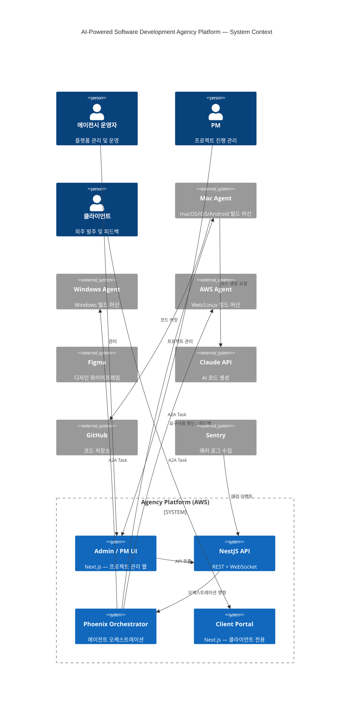
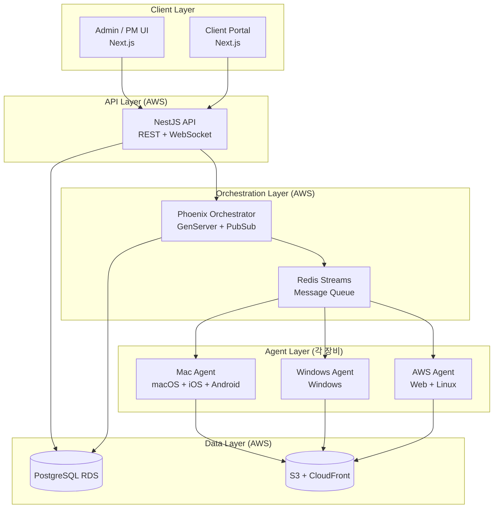
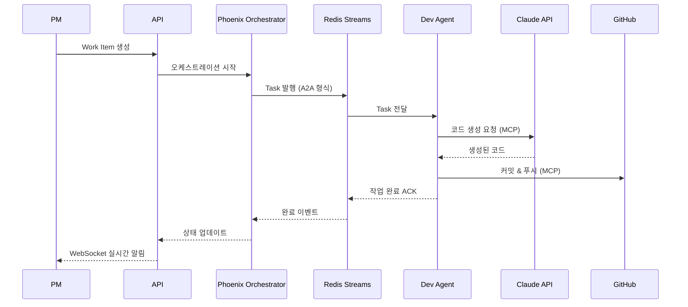
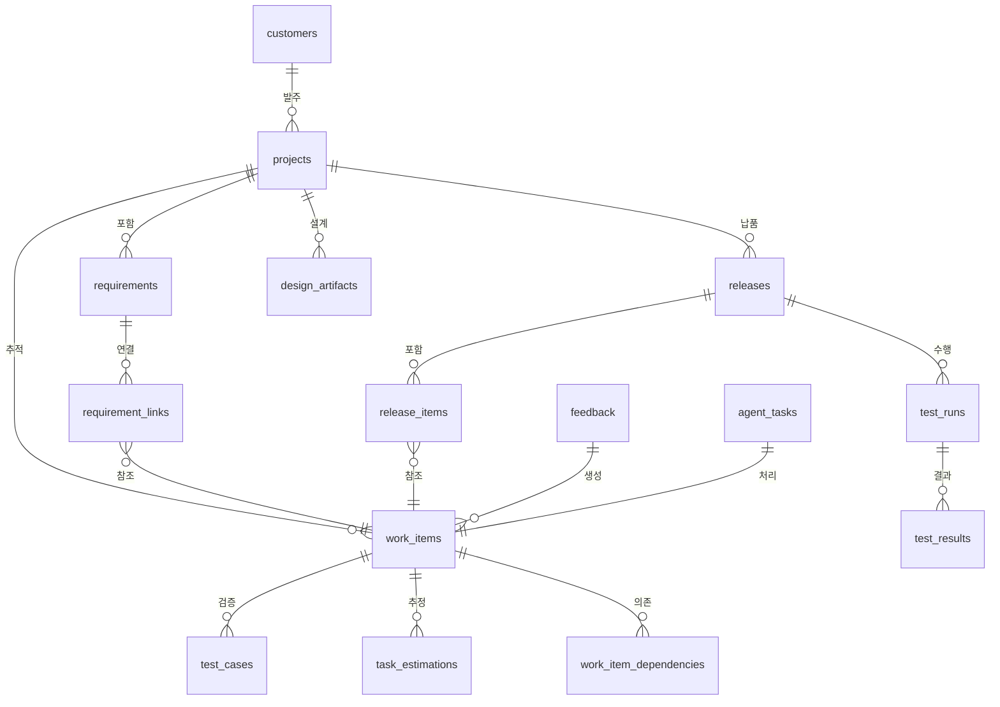

---
tags:
  - requirements
  - srs
  - ai-agent
  - saas
  - outsourcing-platform
created: 2026-04-08
status: draft
version: 0.1
related: "[[AI-Powered Software Development Agency Platform]]"
---

# AI-Powered Software Development Agency Platform
## 요구사항 명세서 (SRS v0.1)

> **범위**: 외주 수주부터 납품·유지보수까지 AI 에이전트가 자동 처리하는  
> 멀티 플랫폼 소프트웨어 에이전시 SaaS 플랫폼의 기능/비기능 요구사항 정의

---

## 목차

1. [프로젝트 개요](#1-프로젝트-개요)
2. [이해관계자 및 사용자](#2-이해관계자-및-사용자)
3. [시스템 컨텍스트 다이어그램](#3-시스템-컨텍스트-다이어그램)
4. [기능 요구사항](#4-기능-요구사항)
   - 4.1 CRM & 영업 관리
   - 4.2 프로젝트 관리
   - 4.3 요구사항 관리 (Cucumber DSL)
   - 4.4 AI 에이전트 오케스트레이션
   - 4.5 멀티 플랫폼 개발 에이전트
   - 4.6 디자인 뷰어 (Mermaid + Figma)
   - 4.7 QA & 테스트 관리
   - 4.8 빌드 & 배포 관리
   - 4.9 납품 & 고객 포털
   - 4.10 배포 후 피드백 루프
5. [비기능 요구사항](#5-비기능-요구사항)
6. [시스템 아키텍처 요구사항](#6-시스템-아키텍처-요구사항)
7. [에이전트 역할 정의](#7-에이전트-역할-정의)
8. [데이터 요구사항](#8-데이터-요구사항)
9. [인터페이스 요구사항](#9-인터페이스-요구사항)
10. [제약 사항 및 가정](#10-제약-사항-및-가정)
11. [용어 정의](#11-용어-정의)

---

## 1. 프로젝트 개요

### 1.1 목적

외주 소프트웨어 개발 에이전시 운영을 AI 에이전트로 자동화하여, 소수 인력으로 다수 프로젝트를 동시에 수주·개발·납품할 수 있는 플랫폼을 구축한다.

### 1.2 배경

- 소프트웨어 외주 개발은 인력 의존도가 높아 확장성 제한
- 다양한 플랫폼(Mac/Windows/iOS/Android/Web/Linux) 지원 수요 증가
- AI 코드 생성 기술 성숙 → 에이전트 기반 개발 자동화 가능
- 요구사항~납품~피드백 전 주기 추적 필요

### 1.3 범위

```
포함 (In Scope)                     제외 (Out of Scope)
────────────────────────────────    ────────────────────────────
CRM (고객/계약 관리)                 HR / 급여 관리
멀티 프로젝트 관리                   회계 / 세금 처리
AI 에이전트 오케스트레이션           자체 AI 모델 학습
멀티 플랫폼 빌드 자동화              물리적 디바이스 관리
요구사항~완료 전체 추적              마케팅 자동화
배포 후 피드백 수집 및 처리
```

### 1.4 플랫폼 지원 범위

| 플랫폼 | 기술 | 빌드 장비 |
|--------|------|-----------|
| macOS 앱 | Flutter / Dart | Mac (M-series) |
| Windows 앱 | Flutter / Dart | Windows PC |
| iOS 앱 | Flutter / Dart | Mac Mini |
| Android 앱 | Flutter / Dart | Mac Mini |
| Web | Next.js / React | AWS EC2 |
| Linux 앱 | Flutter / Dart | AWS EC2 |

---

## 2. 이해관계자 및 사용자

### 2.1 이해관계자

| 이해관계자 | 역할 | 주요 관심사 |
|------------|------|-------------|
| 에이전시 운영자 | 플랫폼 오너 | 수익성, 납품 품질, 자동화율 |
| 프로젝트 매니저 | 프로젝트 감독 | 일정, 진척도, 리스크 |
| 외주 클라이언트 | 프로젝트 발주자 | 요구사항 반영, 납품 일정 |
| 개발 에이전트 | AI 코드 생성기 | 명확한 태스크, 도구 접근 |

### 2.2 사용자 역할 (Role)

| Role | 설명 | 주요 화면 |
|------|------|-----------|
| `admin` | 에이전시 운영자 | 전체 대시보드, CRM, 설정 |
| `pm` | 프로젝트 매니저 | 프로젝트 관리, 요구사항, QA |
| `client` | 외주 클라이언트 | 클라이언트 포털 (읽기 전용 + 피드백) |
| `agent` | AI 에이전트 | API 전용 (UI 없음) |

---

## 3. 시스템 컨텍스트 다이어그램



---

## 4. 기능 요구사항

> 요구사항 ID 형식: `FR-[모듈번호]-[순번]`  
> 우선순위: **P0** (필수) / **P1** (중요) / **P2** (희망)

---

### 4.1 CRM & 영업 관리

| ID | 요구사항 | 우선순위 |
|----|----------|----------|
| FR-01-01 | 고객사 정보(회사명, 담당자, 연락처, 계약 이력)를 등록·수정·조회할 수 있어야 한다 | P0 |
| FR-01-02 | 영업 기회(Opportunity)를 생성하고 단계(리드→협상→계약→완료)별로 관리할 수 있어야 한다 | P0 |
| FR-01-03 | 계약서 정보(계약 금액, 납기일, 플랫폼 범위)를 프로젝트와 연결하여 저장할 수 있어야 한다 | P0 |
| FR-01-04 | CRM Agent는 신규 영업 기회 발생 시 PM에게 자동으로 알림을 전송해야 한다 | P1 |
| FR-01-05 | 계약 만료일 30/7/1일 전 자동 알림을 발송해야 한다 | P1 |

---

### 4.2 프로젝트 관리

| ID | 요구사항 | 우선순위 |
|----|----------|----------|
| FR-02-01 | 프로젝트를 무제한으로 생성할 수 있어야 하며, 각 프로젝트는 독립적으로 관리된다 | P0 |
| FR-02-02 | 프로젝트별 지원 플랫폼(macOS/Windows/iOS/Android/Web/Linux)을 선택할 수 있어야 한다 | P0 |
| FR-02-03 | 작업 항목(Work Item)을 계층 구조(Epic → Story → Task)로 관리할 수 있어야 한다 | P0 |
| FR-02-04 | 각 Work Item은 상태(backlog→in_progress→review→done), 담당 에이전트, 플랫폼을 가져야 한다 | P0 |
| FR-02-05 | PERT 기반 일정 추정: task_estimations + 의존관계로 Critical Path를 자동 계산해야 한다 | P1 |
| FR-02-06 | 프로젝트 진척률(완료 Work Item / 전체 Work Item)을 실시간으로 대시보드에 표시해야 한다 | P0 |
| FR-02-07 | 프로젝트별 에이전트 오케스트레이션 설정(단계, 병렬/순차, 성공/실패 라우팅)을 JSON DSL로 저장·편집할 수 있어야 한다 | P0 |
| FR-02-08 | 요구사항 → Work Item → 테스트케이스 → 릴리스까지 완전한 추적성(Traceability)을 제공해야 한다 | P0 |

---

### 4.3 요구사항 관리 (Cucumber DSL)

| ID | 요구사항 | 우선순위 |
|----|----------|----------|
| FR-03-01 | 요구사항은 Cucumber BDD Feature 파일 형식(Given/When/Then)으로 작성·저장되어야 한다 | P0 |
| FR-03-02 | Feature 파일에 `@platform` 태그(macos, windows, ios, android, web, linux)를 지정하여 플랫폼별 범위를 정의할 수 있어야 한다 | P0 |
| FR-03-03 | PM Agent는 자연어 요구사항을 입력받아 Cucumber Feature 파일을 자동 생성해야 한다 | P1 |
| FR-03-04 | 요구사항 변경 이력(버전)이 보존되어야 한다 | P0 |
| FR-03-05 | Feature 파일로부터 Work Item이 자동으로 생성되어야 한다 | P1 |
| FR-03-06 | 요구사항과 테스트케이스 간 연결(requirement_links)을 자동으로 추적해야 한다 | P0 |

---

### 4.4 AI 에이전트 오케스트레이션

| ID | 요구사항 | 우선순위 |
|----|----------|----------|
| FR-04-01 | Phoenix Orchestrator는 프로젝트별 오케스트레이션 설정에 따라 에이전트 작업을 순차/병렬로 실행해야 한다 | P0 |
| FR-04-02 | 에이전트 간 통신은 A2A(Agent-to-Agent) 프로토콜 표준을 준수해야 한다 | P0 |
| FR-04-03 | 에이전트 ↔ 도구(Figma, Git, S3, DB) 연결은 MCP(Model Context Protocol)를 통해야 한다 | P0 |
| FR-04-04 | 각 에이전트는 A2A Agent Card를 게시하여 자신의 능력(skills), 입력 형식, 상태를 선언해야 한다 | P0 |
| FR-04-05 | 작업 상태는 submitted → working → completed / failed 로 추적되어야 한다 | P0 |
| FR-04-06 | 에이전트 작업 실패 시 재시도(retry) 횟수와 fallback 경로를 설정할 수 있어야 한다 | P0 |
| FR-04-07 | 오케스트레이터는 Redis Streams를 메시지 브로커로 사용하여 에이전트 작업 큐를 관리해야 한다 | P0 |
| FR-04-08 | 관리자는 실시간으로 에이전트 상태(활성/비활성/작업 중)를 모니터링할 수 있어야 한다 | P0 |
| FR-04-09 | 프로젝트마다 독립적인 오케스트레이션 설정을 가질 수 있어야 한다 | P0 |

---

### 4.5 멀티 플랫폼 개발 에이전트

| ID | 요구사항 | 우선순위 |
|----|----------|----------|
| FR-05-01 | 각 장비(Mac/Windows/Mac Mini/AWS)에 에이전트가 설치되어 Phoenix Orchestrator와 연결되어야 한다 | P0 |
| FR-05-02 | Ansible Playbook으로 각 장비에 필요한 도구(Flutter SDK, Xcode, Android SDK 등)를 자동 설치·구성해야 한다 | P0 |
| FR-05-03 | Dev Agent는 Work Item을 수신하면 Claude Code CLI를 통해 코드를 자동 생성해야 한다 | P0 |
| FR-05-04 | 생성된 코드는 자동으로 GitHub에 커밋·푸시되어야 한다 | P0 |
| FR-05-05 | Flutter 빌드 명령(flutter build macos/windows/ios/apk/linux)을 플랫폼별로 자동 실행해야 한다 | P0 |
| FR-05-06 | 빌드 결과물(바이너리, .ipa, .apk)은 S3에 자동 업로드되어야 한다 | P0 |
| FR-05-07 | Web 플랫폼은 Next.js 빌드(npm run build)로 처리되어야 한다 | P0 |
| FR-05-08 | 빌드 로그가 실시간으로 WebSocket을 통해 Admin UI에 스트리밍되어야 한다 | P1 |
| FR-05-09 | 각 에이전트 장비의 CPU / 메모리 / 디스크 상태를 모니터링할 수 있어야 한다 | P1 |

---

### 4.6 디자인 뷰어 (Mermaid + Figma)

| ID | 요구사항 | 우선순위 |
|----|----------|----------|
| FR-06-01 | 플랫폼 내에서 Mermaid 다이어그램(아키텍처/ERD/시퀀스/플로우차트)을 미리보기할 수 있어야 한다 | P0 |
| FR-06-02 | Mermaid 뷰어는 테마 전환(default/dark/forest/neutral)을 지원해야 한다 | P1 |
| FR-06-03 | Figma 공유 링크를 입력하면 플랫폼 내 iframe으로 와이어프레임을 미리볼 수 있어야 한다 | P0 |
| FR-06-04 | 프로젝트별 설계 산출물(Mermaid 코드, Figma URL)을 버전 관리하여 저장해야 한다 | P0 |
| FR-06-05 | 설계 산출물 저장 시 이전 버전이 보존되어야 한다 (덮어쓰기 금지) | P0 |
| FR-06-06 | Architecture / ERD / Wireframe 탭으로 분리된 Design Hub 페이지를 제공해야 한다 | P0 |
| FR-06-07 | UX Agent는 요구사항을 분석하여 Mermaid 다이어그램 초안을 자동 생성할 수 있어야 한다 | P1 |

---

### 4.7 QA & 테스트 관리

| ID | 요구사항 | 우선순위 |
|----|----------|----------|
| FR-07-01 | 테스트케이스는 Work Item 및 Feature 파일 시나리오와 연결되어야 한다 | P0 |
| FR-07-02 | Test Agent는 빌드 완료 후 자동으로 테스트를 실행하고 결과를 기록해야 한다 | P0 |
| FR-07-03 | 테스트 결과(passed/failed/skipped)는 플랫폼별로 분리하여 저장해야 한다 | P0 |
| FR-07-04 | 테스트 실패 시 관련 Work Item의 상태가 자동으로 'review'로 변경되어야 한다 | P1 |
| FR-07-05 | 릴리스별 테스트 커버리지 및 통과율 리포트를 생성할 수 있어야 한다 | P0 |
| FR-07-06 | QA Agent는 테스트 실패 패턴을 분석하여 회귀 위험 Work Item을 자동 플래깅해야 한다 | P2 |

---

### 4.8 빌드 & 배포 관리

| ID | 요구사항 | 우선순위 |
|----|----------|----------|
| FR-08-01 | 릴리스(Release)를 생성하고 포함할 Work Item 목록을 지정할 수 있어야 한다 | P0 |
| FR-08-02 | Deploy Agent는 릴리스 승인 후 플랫폼별 배포를 자동 실행해야 한다 | P0 |
| FR-08-03 | 배포 전 모든 테스트가 통과되었는지 자동 검증해야 한다 | P0 |
| FR-08-04 | 배포 이력(버전, 날짜, 배포 플랫폼, 결과)이 추적되어야 한다 | P0 |
| FR-08-05 | 배포 실패 시 이전 버전으로 자동 롤백할 수 있어야 한다 | P1 |
| FR-08-06 | 빌드 아티팩트는 S3에 저장되고 CloudFront를 통해 배포되어야 한다 | P0 |

---

### 4.9 납품 & 고객 포털

| ID | 요구사항 | 우선순위 |
|----|----------|----------|
| FR-09-01 | 클라이언트 전용 포털에서 프로젝트 진척률, 릴리스 현황을 조회할 수 있어야 한다 | P0 |
| FR-09-02 | 클라이언트는 요구사항 확인 및 승인/반려를 포털에서 처리할 수 있어야 한다 | P0 |
| FR-09-03 | Report Agent는 프로젝트 완료 시 납품 보고서(진척 요약, 테스트 결과, 빌드 목록)를 자동 생성해야 한다 | P0 |
| FR-09-04 | 납품 보고서는 PDF로 내보낼 수 있어야 한다 | P1 |
| FR-09-05 | 클라이언트는 빌드 다운로드 링크(CloudFront URL)를 포털에서 확인할 수 있어야 한다 | P0 |

---

### 4.10 배포 후 피드백 루프

| ID | 요구사항 | 우선순위 |
|----|----------|----------|
| FR-10-01 | 사용자 피드백(텍스트), 에러 로그(Sentry), 수정 요청(이슈)을 단일 피드백 채널로 수집해야 한다 | P0 |
| FR-10-02 | Triage Agent는 수신된 피드백을 유형(bug/feature/improvement/question)으로 자동 분류해야 한다 | P0 |
| FR-10-03 | Triage Agent는 심각도를 P0(긴급)/P1(높음)/P2(보통)/P3(낮음)으로 자동 분류해야 한다 | P0 |
| FR-10-04 | P0/P1 피드백은 즉시 Work Item으로 변환되고 관련 에이전트에게 자동 할당되어야 한다 | P0 |
| FR-10-05 | 유사 피드백 중복 감지를 위해 벡터 유사도 검색(pgvector)을 활용해야 한다 | P1 |
| FR-10-06 | 피드백 → Work Item → 릴리스까지 전체 처리 이력이 추적되어야 한다 | P0 |
| FR-10-07 | 클라이언트는 포털에서 자신의 피드백 처리 상태를 실시간 확인할 수 있어야 한다 | P0 |

---

## 5. 비기능 요구사항

### 5.1 성능 (Performance)

| ID | 요구사항 | 측정 기준 |
|----|----------|-----------|
| NFR-P-01 | 관리 UI 페이지 로딩 | 3초 이내 (LCP) |
| NFR-P-02 | API 응답 시간 | 95퍼센타일 500ms 이내 |
| NFR-P-03 | 에이전트 작업 큐 처리 | 메시지 수신 후 1초 이내 에이전트 전달 |
| NFR-P-04 | 동시 프로젝트 처리 | 최소 10개 프로젝트 동시 개발 지원 |
| NFR-P-05 | Mermaid 렌더링 | 500줄 다이어그램 2초 이내 렌더 |

### 5.2 가용성 & 신뢰성 (Availability & Reliability)

| ID | 요구사항 |
|----|----------|
| NFR-A-01 | Admin UI / API 가용성 99.5% 이상 (월 기준) |
| NFR-A-02 | 에이전트 장비 중 1대 다운 시 해당 플랫폼 작업만 중단, 나머지 플랫폼은 정상 동작 |
| NFR-A-03 | 에이전트 작업 실패 시 자동 재시도 (최대 3회) 후 알림 발송 |
| NFR-A-04 | PostgreSQL RDS Multi-AZ 구성으로 데이터 손실 방지 |
| NFR-A-05 | Redis Streams 메시지는 ACK 전까지 보존되어야 한다 |

### 5.3 보안 (Security)

| ID | 요구사항 |
|----|----------|
| NFR-S-01 | 모든 API 호출은 JWT 인증을 거쳐야 한다 |
| NFR-S-02 | 클라이언트는 자신의 프로젝트 데이터만 접근 가능해야 한다 (Row-Level Security) |
| NFR-S-03 | Claude API 키, Figma 토큰 등 민감 정보는 AWS Secrets Manager에 저장해야 한다 |
| NFR-S-04 | 에이전트 간 통신(A2A)은 TLS 1.3으로 암호화되어야 한다 |
| NFR-S-05 | 빌드 아티팩트 다운로드 URL은 서명된 임시 URL(Presigned URL, 24시간 유효)이어야 한다 |

### 5.4 유지보수성 (Maintainability)

| ID | 요구사항 |
|----|----------|
| NFR-M-01 | 새 플랫폼 에이전트 추가 시 Orchestrator 코드 수정 없이 Agent Card 등록만으로 연동되어야 한다 |
| NFR-M-02 | 오케스트레이션 설정(JSON DSL) 변경은 재배포 없이 즉시 적용되어야 한다 |
| NFR-M-03 | 모든 에이전트 작업 로그는 최소 90일 보존되어야 한다 |
| NFR-M-04 | 전체 인프라는 Ansible Playbook 1회 실행으로 신규 장비에 재현 가능해야 한다 |

### 5.5 확장성 (Scalability)

| ID | 요구사항 |
|----|----------|
| NFR-SC-01 | NestJS API는 수평 확장(ECS 컨테이너 증설)이 가능해야 한다 |
| NFR-SC-02 | 에이전트 장비를 추가 등록하는 방식으로 처리 용량을 선형 확장할 수 있어야 한다 |
| NFR-SC-03 | 프로젝트 수 증가에 따른 DB 성능 저하 방지를 위해 project_id 기준 파티셔닝을 고려해야 한다 |

---

## 6. 시스템 아키텍처 요구사항

### 6.1 레이어 구성



### 6.2 에이전트 통신 프로토콜

| 통신 유형 | 프로토콜 | 용도 |
|-----------|----------|------|
| 에이전트 ↔ 에이전트 | A2A (Agent-to-Agent) | 작업 위임, 상태 보고 |
| 에이전트 ↔ 도구 | MCP (Model Context Protocol) | Figma, Git, DB, S3 접근 |
| UI ↔ API | REST / WebSocket | 데이터 조회, 실시간 스트림 |
| API ↔ Orchestrator | Internal HTTP | 오케스트레이션 명령 |
| Orchestrator ↔ Agent | Redis Streams + WebSocket | 작업 큐, 상태 업데이트 |

### 6.3 데이터 흐름



---

## 7. 에이전트 역할 정의

| 에이전트 | 담당 영역 | 입력 | 출력 |
|----------|-----------|------|------|
| **CRM Agent** | 영업 기회 관리, 계약 초안 | 고객 문의, 요구사항 문서 | 계약 초안, PM 알림 |
| **PM Agent** | 요구사항 분석, Work Item 생성 | 자연어 요구사항 | Cucumber Feature 파일, Work Item |
| **Architecture Agent** | 시스템 설계 | Feature 파일, 기술 스택 | Mermaid 아키텍처 다이어그램 |
| **UX Agent** | UI/UX 설계 | 요구사항, Figma 링크 | 화면 설계 명세, Mermaid 플로우 |
| **Mac Dev Agent** | macOS / iOS / Android 개발 | Work Item, Figma URL | Flutter 코드, 빌드 아티팩트 |
| **Windows Dev Agent** | Windows 개발 | Work Item | Flutter 코드, Windows 빌드 |
| **AWS Dev Agent** | Web / Linux 개발 | Work Item | Next.js 코드, Linux 빌드 |
| **Test Agent** | 자동화 테스트 실행 | 빌드 아티팩트, 테스트케이스 | 테스트 결과, 커버리지 리포트 |
| **Deploy Agent** | 배포 자동화 | 승인된 릴리스 | 배포 완료, CloudFront URL |
| **Report Agent** | 납품 보고서 생성 | 프로젝트 데이터 전체 | PDF 납품 보고서 |
| **Triage Agent** | 피드백 분류 & Work Item 생성 | 사용자 피드백, Sentry 에러 | 분류된 Work Item, 알림 |
| **QA Agent** | 품질 게이팅, 회귀 감지 | 테스트 이력, 코드 변경 | 위험 Work Item 목록, QA 리포트 |

---

## 8. 데이터 요구사항

### 8.1 핵심 엔티티 관계



### 8.2 데이터 보존 정책

| 데이터 유형 | 보존 기간 | 비고 |
|-------------|-----------|------|
| 프로젝트 데이터 | 영구 | 계약 종료 후 아카이브 |
| 에이전트 작업 로그 | 90일 | S3 Glacier 장기 보관 |
| 빌드 아티팩트 | 릴리스당 최신 3개 | 구버전 S3 자동 삭제 |
| 피드백 원문 | 1년 | Work Item 전환 후 90일 |
| 테스트 결과 | 영구 | 추적성 요구 |

---

## 9. 인터페이스 요구사항

### 9.1 Admin / PM UI 페이지 목록

| 페이지 | 경로 | 주요 기능 |
|--------|------|-----------|
| 대시보드 | `/dashboard` | 전체 프로젝트 현황, 에이전트 상태 |
| 프로젝트 목록 | `/projects` | 프로젝트 생성·조회·필터 |
| 프로젝트 상세 | `/projects/:id` | Work Item, 진척률, 릴리스 |
| 요구사항 관리 | `/projects/:id/requirements` | Feature 파일 편집·버전 관리 |
| 디자인 허브 | `/projects/:id/design` | Mermaid 뷰어 + Figma 뷰어 탭 |
| Work Item | `/projects/:id/items` | Kanban / 리스트 뷰 |
| QA | `/projects/:id/qa` | 테스트케이스, 테스트 결과 |
| 빌드 & 배포 | `/projects/:id/releases` | 릴리스 생성·배포 이력 |
| 에이전트 모니터 | `/agents` | 에이전트 상태, 작업 로그 실시간 |
| 피드백 관리 | `/feedback` | 수신 피드백, Triage 결과 |
| CRM | `/crm` | 고객사, 영업 기회, 계약 |
| 설정 | `/settings` | 에이전트 등록, 오케스트레이션 DSL |

### 9.2 Client Portal 페이지 목록

| 페이지 | 경로 | 주요 기능 |
|--------|------|-----------|
| 내 프로젝트 | `/portal/projects` | 자신의 프로젝트 목록 |
| 진척 현황 | `/portal/projects/:id` | 진행률, 마일스톤 |
| 요구사항 확인 | `/portal/projects/:id/requirements` | 승인 / 반려 |
| 빌드 다운로드 | `/portal/projects/:id/releases` | 배포 버전 다운로드 |
| 피드백 등록 | `/portal/projects/:id/feedback` | 피드백 작성, 처리 현황 |
| 납품 보고서 | `/portal/projects/:id/report` | PDF 보고서 조회 |

### 9.3 외부 연동 인터페이스

| 시스템 | 연동 방식 | 용도 |
|--------|-----------|------|
| Figma | Embed API (iframe) + REST API | 와이어프레임 미리보기, 에셋 추출 |
| GitHub | MCP (git tool) | 코드 커밋, PR 생성 |
| Claude API | HTTP (Anthropic SDK) | AI 코드 생성 |
| Sentry | Webhook | 에러 로그 수신 |
| S3 / CloudFront | AWS SDK | 아티팩트 저장·배포 |
| SMTP / Slack | 알림 서비스 | 이메일·슬랙 알림 |

---

## 10. 제약 사항 및 가정

### 10.1 기술적 제약

- iOS 빌드는 반드시 macOS 환경(Mac Mini)에서 실행되어야 한다 (Apple 정책)
- Windows 빌드는 Windows 물리 장비 또는 VM에서 실행되어야 한다
- Figma Embed는 공개 공유 링크 또는 Figma Viewer 토큰이 필요하다
- Claude API 사용량은 프로젝트별 예산 한도 설정이 필요하다

### 10.2 가정

- 각 플랫폼 빌드 장비(Mac, Windows, Mac Mini)는 인터넷에 연결되어 있다
- 클라이언트는 Figma 공유 링크를 제공할 수 있다
- 모든 에이전트 장비는 Phoenix Orchestrator와 WebSocket 연결을 유지한다
- AWS 인프라(RDS, ElastiCache, S3, EC2)는 사전 프로비저닝되어 있다

---

## 11. 용어 정의

| 용어 | 정의 |
|------|------|
| **Work Item** | 개발 단위 작업 (Epic / Story / Task 계층) |
| **Orchestrator** | 에이전트 작업 흐름을 조율하는 Phoenix 서버 |
| **A2A** | Agent-to-Agent Protocol — 에이전트 간 표준 통신 규약 |
| **MCP** | Model Context Protocol — 에이전트와 외부 도구 연결 규약 |
| **Agent Card** | 에이전트가 자신의 능력과 엔드포인트를 선언하는 JSON 문서 |
| **DSL** | Domain-Specific Language — 오케스트레이션 설정용 JSON 문법 |
| **Triage** | 수신된 피드백을 유형·심각도별로 분류하는 과정 |
| **Feature File** | Cucumber BDD 형식의 요구사항 명세 파일 (.feature) |
| **Traceability** | 요구사항 → Work Item → 테스트 → 릴리스 전 구간 연결 추적 |
| **Critical Path** | PERT 일정에서 프로젝트 완료 시간을 결정하는 최장 경로 |
| **Presigned URL** | AWS S3 임시 서명 다운로드 URL (유효 시간 제한) |

---

*마지막 업데이트: 2026-04-08 | 버전: 0.1 | 상태: Draft*
